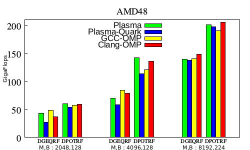
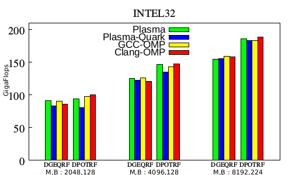
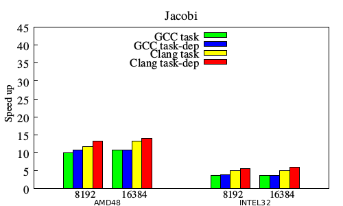
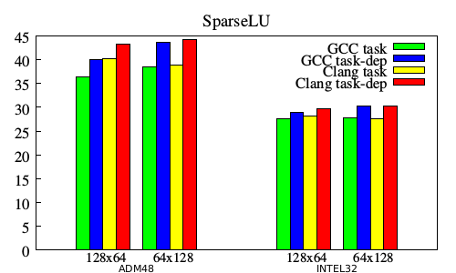
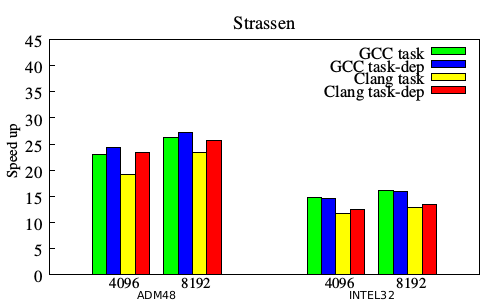

#Performance evaluation

##Presentation

The following results were obtained using GCC 4.9 and clang-omp 3.4, on two different NUMA configurations.

The first one holds 8 AMD Magny Cours processors for a total of 48 cores. We will refer to this configuration as **AMD48**.

The second one holds 6 Intel Xeon E5-4620 processors for a total of 32 cores. We will refer to this configuration as **INTEL32**.

##Plasma

The DPOTRF and DGEQRF algorithms from Plasma rely on the BLAS library. We used different versions of optimized BLAS depending on the machine: ATLAS 3.10.1 was used on INTEL32, and ATLAS 3.8.4 was used on AMD48.
Measurements were conducted using the maximum number of CPUs for each machine.
The performance results are expressed in gigaflops (the higher the better), from an average of 10 runs, with an average standard deviation of 2 Gflops.

We compared four versions of these algorithms:

* The original PLASMA implementation with static scheduling (Plasma)
* The dynamic scheduling implementation on top of Quark runtime (Plasma-Quark)
* KASTORS OpenMP version compiled with GCC/libGOMP (GCC-OMP)
* KASTORS OpenMP and CLANG/libIOMP (Clang-OMP)

Each version was run on the following matrix size (M) / block size (B) couples: (2048 / 128), (4096 / 128), (8192 / 224).

For both algorithms the results are positive: on both machines the OpenMP versions compete with the original versions.
In several cases, the Clang-OMP version even leads by a slight margin. The overall good results of the original static version can be explained by the fact that it does not have to pay the overhead of task creation.

One can also notice that QUARK-based versions always are slightly slower than both CLANG and GCC implementations for small matrix sizes, which leads to the conclusion that the libGOMP and libIOMP runtimes induce less overhead and provide a better handling of fine-grain tasks than QUARK.
The conclusion is encouraging, as we were able to get similar or better performance results using a portable OpenMP-based approach than with a specifically designed runtime.

##Jacobi/Poisson2D

For the next kernels we compared the following four versions :

* Independent tasks compiled with GCC/libGOMP (GCC-task)
* Dependent tasks compiled with GCC/libGOMP (GCC-dep)
* Independent tasks compiled with CLANG/libIOMP (Clang-omp)
* Dependent tasks compiled with CLANG/libIOMP (Clang-dep)

The speedup of both independent tasks and dependent tasks versions are low: less than 14 on AMD48 and 6 on INTEL32.
The application is memory bound with about the same number of arithmetic operations per load and store.

The Poisson2D code is an iterative computation in which at each time-step tasks are created to update the sub domain of the initial grid.
One of the important problem is that tasks are not bound to resources in order to take into account data locality.
Typical scenario is that tasks between successive iterations may be performed by different threads of the same parallel region.

Neither the CLANG or the GCC runtime tries to schedule tasks in order to maximize data reuse. Moreover, tasks that access to same data (due to sharing of frontiers between two sub-domains) may be better scheduled if they are mapped to core on the same NUMA node.

It is challenging for OpenMP runtime developers to take into account data dependencies in order to better schedule tasks to improve data locality.

##SparseLU

For this benchmark we used two matrices and sub-matrices sizes : 128x64 and 64x128.

For every tested configuration, the dependent task version outperforms the independent task version for both compilers.
The best speed up is achieved using the 64x128 configuration.

The OpenMP 4.0 version using dependencies performs slightly better in most cases because it is able to exploit inter-iteration parallelism. This confirms that using data-flow dependencies can lead to a better use of CPUs.

##Strassen
The Strassen matrix multiplication is typically performed in 3 steps: a matrix add, a matrix multiply and a matrix add again.
The most expensive part is the multiply, but the first adds are not negligible. Thus we define dependences between these two parts.
We apply a recurse cutoff of 5, and for matrix smaller than 128x128, multiplies are computed with the usual algorithm instead of Strassen.
Experiments were made using two matrix/blocksize combinations: 8192/128, 16384/128.

Speed up were measured from an average of 10 runs. The dependent task version very slightly outperforms the independent task version for both compilers on most test
cases.

We can also notice that these fine-grains dependencies expressions are at the bleeding-edge of the OpenMP 4.0 implementation for both GCC and Clang, as some finer dependencies are not yet supported by these compilers.

